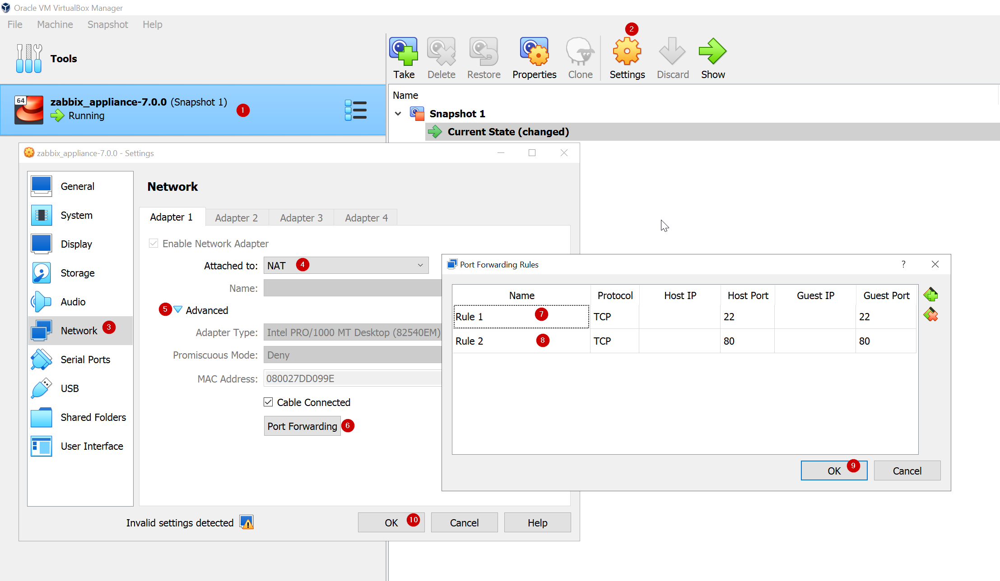

# Notes on how use Browser item in Zabbix 7.0

Launch a single browser via docker:
```
docker run --name browser \
-p 4444:4444 \
-p 7900:7900 \
--shm-size="2g" \
-d selenium/standalone-chrome:latest
```

With podman:
```
podman run --name browser \
-p 4444:4444 \
-p 7900:7900 \
--shm-size="2g" \
-d selenium/standalone-chrome:latest
```

Test if there is a port listening:
```
ss --tcp --listen --numeric | grep 4444
```

On docker host, this must produce back some HTML:
```
curl -L 127.0.0.1:4444 
```


For testing can use Zabbix appliance 7.0.0

https://cdn.zabbix.com/zabbix/appliances/stable/7.0/7.0.0/zabbix_appliance-7.0.0-ovf.tar.gz

If nothing else is listening on port 80 and 22, we can link SSH and HTTP to 127.0.0.1




Install more tools on appliance:
```
dnf -y install vim jq zabbix-js nc
```

Do not install/use docker inside appliance. It does not work (at least with VirtualBox with NAT connection). Problem is to resolve DNS inside container. The web browser must run on another server!

Inside appliance, test connection to docker host which runs the browser:
```
nc -zv 192.168.88.59 4444
```

JavaScript supported elements and methods

https://www.zabbix.com/documentation/7.0/en/manual/config/items/preprocessing/javascript/browser_item_javascript_objects


More browser flavours:

https://hub.docker.com/u/selenium


# Q & A

Q: Is it possible to send a screenshots via email

A: No


